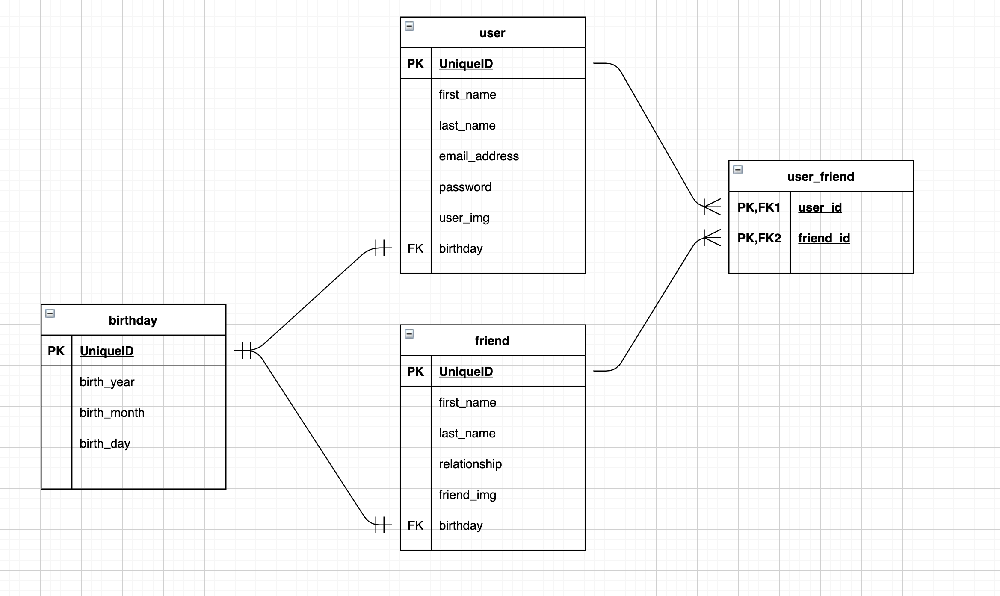

<!-- @format -->

# Auguri

_Welcome to the birthday solution. Never forget a birthday again with this innovative and easy to use app._

This is an application created as part of my Springboard Computer Science Bootcamp.

Getting Started
Welcome to a revolutionary birthday application! Once a user has sucessfully signed up for an account, they will be directed to the main page, which shows a list of their friends and the number of days until their birthday. Users are encouraged to add new friends.

Sending Personal Greetings
This incredible application possesses the powerful capability of emailing you and your friends. Here, there is a variety of different options...

1. Option 1 You may want to construct pre-written personal messages for each of your friends. If your write a personal message, that message will be sent to your friend at exactly midnight on the day of their birthday. Your friend will surely feel cared for!

2. Option 2 You may choose not to write any personal birthday greetings through Auguri. In this case, Auguri will not email your friends on their birthday. Instead, Auguri will email you with a small reminder.

3. Option 3 You are also welcome to do a combination of these choices... writing automated personal messages for some friends and not doing so for others.

API: https://sendgrid.com/
CronJobs

